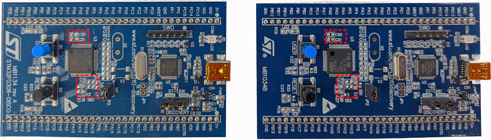
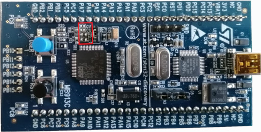
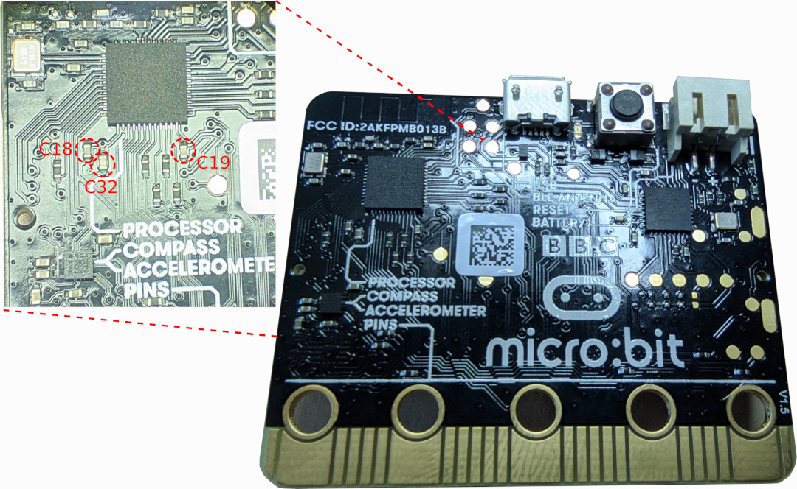

Traces acquisition
==================

Acquisition setup
-----------------

The acquisition setup depends on what you want to model. Here we are going to
give instructions to acquire power traces from some STM32F0/STM32F1 boards
but you should adapt to your hardware.

Target preparation
^^^^^^^^^^^^^^^^^^

For power traces side channel using a power probe,
some capacitors may be removed from the target
to reduce filtering and get better quality traces.
**This operation can destroy the board or make it unstable.**
Be careful and do this at your own risk.

To find which capacitors to remove, you might refer to the board schematics
and look at capacitors between ground and :math:`V_{DD}`. These capacitors are
often located near the core.

    STM32F030 and STM32F051 prepared by removing ``C18``, ``C19``, ``C20`` and
    ``C21`` capacitors.

    STM32VL prepared by removing ``C18``, ``C19``, ``C20`` and
    ``C21`` capacitors.

    BBC Micro:bit prepared by removing ``C18``, ``C19`` and ``C32`` capacitors.

To output the external crystal oscillator clock on ST STM32F030 or STM32F051
Discovery boards, you need to bridge ``SB17``. Then the clock will be outputted
on ``PF0``.

Power probe or resistor setup
^^^^^^^^^^^^^^^^^^^^^^^^^^^^^

..  figure:: ../_static/images/stm32f0_power_probe_setup.*
    :width: 620
    :alt: Setup with power probe

    Acquisition setup using a power probe.

You can either use a resistor or a current probe in series with the target.
We used a stabilized external DC power supply.
Remember to check the bandwidth of the different elements of your setup.

Oscilloscope setup
^^^^^^^^^^^^^^^^^^

You should set the gain to capture the full dynamic range of the side-channel
trace.
We choose to input the target clock on the second channel to be able to isolate
clock cycles.

Programmer setup
^^^^^^^^^^^^^^^^

The STM32VL Discovery board has a ST-Link v1 that does not work well with
OpenOCD. We can connect an external ST-Link v2 by disconnecting the 2 jumpers
between the on-board ST-Link and the target, then following this:

+------------+------------------+
| Programmer | STM32VLDiscovery |
+============+==================+
| SWDIO      | PA13             |
+------------+------------------+
| SWCLK      | PA14             |
+------------+------------------+
| TRST       | RST              |
+------------+------------------+
| GND        | GND              |
+------------+------------------+
| VAPP       | 3V/VDD           |
+------------+------------------+

The external ST-Link will not power the target.

Sample acquisition script
-------------------------

Abby includes modules to automate the flashing process of firmware
and control the oscilloscope.

The following script acquires traces while executing specific code on
target.

..  literalinclude:: ../scripts/trace_acquisition.py
    :language: python
    :linenos:

Converting acquired traces to Riscure Inspector format
------------------------------------------------------

Riscure provide ``trsfile`` Python module to read and write to Riscure Inspector
format. If you don't want to work with Python and prefer Inspector, you can
adapt the following piece of code to convert from Numpy to Inspector:

..  code-block:: python

    from trsfile import trs_open, Trace, SampleCoding, TracePadding, Header

    MY_TRACES = []  # array of tuples (input_text as bytes, trace as np.array)
    with trs_open("output.trs", "w",
        headers={Header.LABEL_X: 'Samples', Header.LABEL_Y: 'Power'},
        padding_mode=TracePadding.AUTO,
    ) as trs:
        for input_text, trace in MY_TRACES:
            trs.append(Trace(
                SampleCoding.FLOAT,
                trace,
                data=input_text,
            ))
